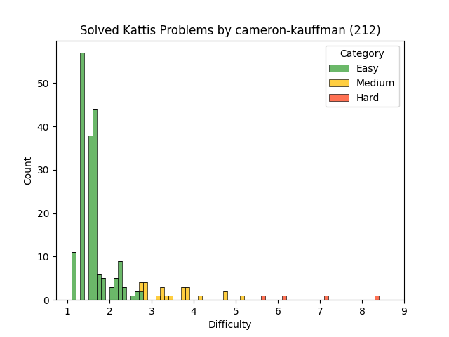

# Cameron's Kattis Problems

These are problems I have solved on [Kattis](https://open.kattis.com)
while preparing for competitive programming competitions.

### Problem Difficulty

<table>
<thead>
<td>Name</td>
<td>Difficulty</td>
<td>Link</td>
</thead>
<tbody>

<tr>
<td>1-D Frogger (Easy)</td>
<td>3.3</td>
<td>https://open.kattis.com/problems/1dfroggereasy</td>
</tr>

<tr>
<td>3D Printed Statues</td>
<td>2.8</td>
<td>https://open.kattis.com/problems/3dprinter</td>
</tr>

<tr>
<td>4 thought</td>
<td>3.2</td>
<td>https://open.kattis.com/problems/4thought</td>
</tr>

<tr>
<td>Eight Queens</td>
<td>2.9</td>
<td>https://open.kattis.com/problems/8queens</td>
</tr>

<tr>
<td>99 Problems</td>
<td>2.7</td>
<td>https://open.kattis.com/problems/99problems</td>
</tr>

<tr>
<td>A1 Paper</td>
<td>4.2</td>
<td>https://open.kattis.com/problems/a1paper</td>
</tr>

<tr>
<td>Aaah!</td>
<td>1.5</td>
<td>https://open.kattis.com/problems/aaah</td>
</tr>

<tr>
<td>Above Average</td>
<td>2.1</td>
<td>https://open.kattis.com/problems/aboveaverage</td>
</tr>

<tr>
<td>A Cappella Recording</td>
<td>2.9</td>
<td>https://open.kattis.com/problems/acappellarecording</td>
</tr>

<tr>
<td>ACM Contest Scoring</td>
<td>1.9</td>
<td>https://open.kattis.com/problems/acm</td>
</tr>

<tr>
<td>Adding Trouble</td>
<td>1.3</td>
<td>https://open.kattis.com/problems/addingtrouble</td>
</tr>

<tr>
<td>Add Two Numbers</td>
<td>1.3</td>
<td>https://open.kattis.com/problems/addtwonumbers</td>
</tr>

<tr>
<td>Afjörmun</td>
<td>1.6</td>
<td>https://open.kattis.com/problems/afjormun</td>
</tr>

<tr>
<td>Air Conditioned Minions</td>
<td>3.3</td>
<td>https://open.kattis.com/problems/airconditioned</td>
</tr>

<tr>
<td>Airfare Grants</td>
<td>1.3</td>
<td>https://open.kattis.com/problems/airfaregrants</td>
</tr>

<tr>
<td>Alehouse</td>
<td>4.0</td>
<td>https://open.kattis.com/problems/alehouse</td>
</tr>

<tr>
<td>Á leið í bíó</td>
<td>1.1</td>
<td>https://open.kattis.com/problems/aleidibio</td>
</tr>

<tr>
<td>Alphabet Spam</td>
<td>1.7</td>
<td>https://open.kattis.com/problems/alphabetspam</td>
</tr>

<tr>
<td>Amerískur vinnustaður</td>
<td>1.3</td>
<td>https://open.kattis.com/problems/ameriskur</td>
</tr>

<tr>
<td>A Multiplication Game</td>
<td>4.2</td>
<td>https://open.kattis.com/problems/amultiplicationgame</td>
</tr>

<tr>
<td>Another Candies</td>
<td>2.6</td>
<td>https://open.kattis.com/problems/anothercandies</td>
</tr>

<tr>
<td>Anti-Palindrome</td>
<td>1.9</td>
<td>https://open.kattis.com/problems/antipalindrome</td>
</tr>

<tr>
<td>Apaxiaaaaaaaaaaaans!</td>
<td>1.5</td>
<td>https://open.kattis.com/problems/apaxiaaans</td>
</tr>

<tr>
<td>A Pivotal Question</td>
<td>4.3</td>
<td>https://open.kattis.com/problems/apivotalquestion</td>
</tr>

<tr>
<td>A Real Challenge</td>
<td>2.2</td>
<td>https://open.kattis.com/problems/areal</td>
</tr>

<tr>
<td>Arithmetic Functions</td>
<td>1.6</td>
<td>https://open.kattis.com/problems/arithmeticfunctions</td>
</tr>

<tr>
<td>Array Smoothening</td>
<td>3.1</td>
<td>https://open.kattis.com/problems/arraysmoothening</td>
</tr>

<tr>
<td>ASCII kassi</td>
<td>1.5</td>
<td>https://open.kattis.com/problems/asciikassi</td>
</tr>

<tr>
<td>Attendance</td>
<td>1.8</td>
<td>https://open.kattis.com/problems/attendance2</td>
</tr>

<tr>
<td>Autori</td>
<td>1.2</td>
<td>https://open.kattis.com/problems/autori</td>
</tr>

<tr>
<td>Average Character</td>
<td>1.8</td>
<td>https://open.kattis.com/problems/averagecharacter</td>
</tr>

<tr>
<td>Avion</td>
<td>1.5</td>
<td>https://open.kattis.com/problems/avion</td>
</tr>

<tr>
<td>Awkward Party</td>
<td>2.4</td>
<td>https://open.kattis.com/problems/awkwardparty</td>
</tr>

<tr>
<td>Aww Man</td>
<td>3.9</td>
<td>https://open.kattis.com/problems/awwman</td>
</tr>

<tr>
<td>Babelfish</td>
<td>2.7</td>
<td>https://open.kattis.com/problems/babelfish</td>
</tr>

<tr>
<td>Bachet's Game</td>
<td>3.9</td>
<td>https://open.kattis.com/problems/bachetsgame</td>
</tr>

<tr>
<td>Backspace</td>
<td>2.0</td>
<td>https://open.kattis.com/problems/backspace</td>
</tr>

<tr>
<td>Bacon, Eggs, and Spam</td>
<td>2.0</td>
<td>https://open.kattis.com/problems/baconeggsandspam</td>
</tr>

<tr>
<td>Bannorð</td>
<td>1.6</td>
<td>https://open.kattis.com/problems/bannord</td>
</tr>

<tr>
<td>Barcelona</td>
<td>1.3</td>
<td>https://open.kattis.com/problems/barcelona</td>
</tr>

<tr>
<td>Bard</td>
<td>2.4</td>
<td>https://open.kattis.com/problems/bard</td>
</tr>

<tr>
<td>Basketball One-on-One</td>
<td>1.5</td>
<td>https://open.kattis.com/problems/basketballoneonone</td>
</tr>

<tr>
<td>Batter Up</td>
<td>1.4</td>
<td>https://open.kattis.com/problems/batterup</td>
</tr>

<tr>
<td>Battleship</td>
<td>4.6</td>
<td>https://open.kattis.com/problems/battleship</td>
</tr>

<tr>
<td>Battle Simulation</td>
<td>2.4</td>
<td>https://open.kattis.com/problems/battlesimulation</td>
</tr>

<tr>
<td>Bela</td>
<td>1.4</td>
<td>https://open.kattis.com/problems/bela</td>
</tr>

<tr>
<td>BergMál</td>
<td>1.2</td>
<td>https://open.kattis.com/problems/bergmal</td>
</tr>

<tr>
<td>Besta gjöfin</td>
<td>1.3</td>
<td>https://open.kattis.com/problems/bestagjofin</td>
</tr>

<tr>
<td>Betting</td>
<td>1.3</td>
<td>https://open.kattis.com/problems/betting</td>
</tr>

<tr>
<td>Big And</td>
<td>5.4</td>
<td>https://open.kattis.com/problems/bigand</td>
</tr>

<tr>
<td>Big Truck</td>
<td>3.1</td>
<td>https://open.kattis.com/problems/bigtruck</td>
</tr>

<tr>
<td>Bijele</td>
<td>1.3</td>
<td>https://open.kattis.com/problems/bijele</td>
</tr>

<tr>
<td>Bikes and Barricades</td>
<td>2.4</td>
<td>https://open.kattis.com/problems/bikesandbarricades</td>
</tr>

<tr>
<td>Bilað Lyklaborð</td>
<td>1.5</td>
<td>https://open.kattis.com/problems/biladlyklabord</td>
</tr>

<tr>
<td>Bing It On</td>
<td>3.1</td>
<td>https://open.kattis.com/problems/bing</td>
</tr>

<tr>
<td>Bit by Bit</td>
<td>3.2</td>
<td>https://open.kattis.com/problems/bitbybit</td>
</tr>

<tr>
<td>Bitte ein Bit</td>
<td>1.3</td>
<td>https://open.kattis.com/problems/bitteeinbit</td>
</tr>

<tr>
<td>Blaðra</td>
<td>1.3</td>
<td>https://open.kattis.com/problems/bladra2</td>
</tr>

<tr>
<td>Blandað Best</td>
<td>1.2</td>
<td>https://open.kattis.com/problems/blandadbest</td>
</tr>

<tr>
<td>Blueberry Waffle</td>
<td>2.0</td>
<td>https://open.kattis.com/problems/blueberrywaffle</td>
</tr>

<tr>
<td>Boat Parts</td>
<td>2.1</td>
<td>https://open.kattis.com/problems/boatparts</td>
</tr>

<tr>
<td>Bombardment</td>
<td>4.4</td>
<td>https://open.kattis.com/problems/bombardment</td>
</tr>

<tr>
<td>Booking a Room</td>
<td>1.8</td>
<td>https://open.kattis.com/problems/bookingaroom</td>
</tr>

<tr>
<td>Boss Battle</td>
<td>2.0</td>
<td>https://open.kattis.com/problems/bossbattle</td>
</tr>

<tr>
<td>Bracket Matching</td>
<td>2.0</td>
<td>https://open.kattis.com/problems/bracketmatching</td>
</tr>

<tr>
<td>Branch Manager</td>
<td>5.4</td>
<td>https://open.kattis.com/problems/branchmanager</td>
</tr>

<tr>
<td>Breaking Branches</td>
<td>1.6</td>
<td>https://open.kattis.com/problems/breakingbranches</td>
</tr>

<tr>
<td>Brexit</td>
<td>2.6</td>
<td>https://open.kattis.com/problems/brexit</td>
</tr>

<tr>
<td>Buka</td>
<td>2.2</td>
<td>https://open.kattis.com/problems/buka</td>
</tr>

<tr>
<td>Call for Problems</td>
<td>1.3</td>
<td>https://open.kattis.com/problems/callforproblems</td>
</tr>

<tr>
<td>Canadians, eh?</td>
<td>1.6</td>
<td>https://open.kattis.com/problems/canadianseh</td>
</tr>

<tr>
<td>Candy Distribution</td>
<td>4.0</td>
<td>https://open.kattis.com/problems/candydistribution</td>
</tr>

<tr>
<td>Candy Division</td>
<td>3.2</td>
<td>https://open.kattis.com/problems/candydivision</td>
</tr>

<tr>
<td>Candy Store</td>
<td>1.4</td>
<td>https://open.kattis.com/problems/candystore</td>
</tr>

<tr>
<td>Cantina of Babel</td>
<td>3.1</td>
<td>https://open.kattis.com/problems/cantinaofbabel</td>
</tr>

<tr>
<td>Solving for Carrots</td>
<td>1.3</td>
<td>https://open.kattis.com/problems/carrots</td>
</tr>

<tr>
<td>CD</td>
<td>3.9</td>
<td>https://open.kattis.com/problems/cd</td>
</tr>

<tr>
<td>Opening Ceremony</td>
<td>3.4</td>
<td>https://open.kattis.com/problems/ceremony</td>
</tr>

<tr>
<td>Cetvrta</td>
<td>1.4</td>
<td>https://open.kattis.com/problems/cetvrta</td>
</tr>

<tr>
<td>Champernowne Verification</td>
<td>1.5</td>
<td>https://open.kattis.com/problems/champernowneverification</td>
</tr>

<tr>
<td>Chanukah Challenge</td>
<td>1.3</td>
<td>https://open.kattis.com/problems/chanukah</td>
</tr>

<tr>
<td>Chinese Remainder</td>
<td>4.2</td>
<td>https://open.kattis.com/problems/chineseremainder</td>
</tr>

<tr>
<td>Chocolate Division</td>
<td>1.8</td>
<td>https://open.kattis.com/problems/chocolatedivision</td>
</tr>

<tr>
<td>Preludes</td>
<td>1.9</td>
<td>https://open.kattis.com/problems/chopin</td>
</tr>

<tr>
<td>Chopping Wood</td>
<td>3.1</td>
<td>https://open.kattis.com/problems/chopwood</td>
</tr>

<tr>
<td>Cinema Crowds</td>
<td>2.1</td>
<td>https://open.kattis.com/problems/cinema</td>
</tr>

<tr>
<td>Class Field Trip</td>
<td>1.4</td>
<td>https://open.kattis.com/problems/classfieldtrip</td>
</tr>

<tr>
<td>Climbing Worm</td>
<td>2.3</td>
<td>https://open.kattis.com/problems/climbingworm</td>
</tr>

<tr>
<td>A Furious Cocktail</td>
<td>2.8</td>
<td>https://open.kattis.com/problems/cocktail</td>
</tr>

<tr>
<td>Coconut Splat</td>
<td>1.6</td>
<td>https://open.kattis.com/problems/coconut</td>
</tr>

<tr>
<td>Coffee Cup Combo</td>
<td>1.5</td>
<td>https://open.kattis.com/problems/coffeecupcombo</td>
</tr>

<tr>
<td>Coin Stacks</td>
<td>3.6</td>
<td>https://open.kattis.com/problems/coinstacks</td>
</tr>

<tr>
<td>Cold-puter Science</td>
<td>1.3</td>
<td>https://open.kattis.com/problems/cold</td>
</tr>

<tr>
<td>Coloring Socks</td>
<td>2.1</td>
<td>https://open.kattis.com/problems/color</td>
</tr>

<tr>
<td>Jumbled Compass</td>
<td>2.1</td>
<td>https://open.kattis.com/problems/compass</td>
</tr>

<tr>
<td>Composed Rhythms</td>
<td>1.4</td>
<td>https://open.kattis.com/problems/composedrhythms</td>
</tr>

<tr>
<td>Compound Words</td>
<td>2.0</td>
<td>https://open.kattis.com/problems/compoundwords</td>
</tr>

<tr>
<td>Conformity</td>
<td>1.5</td>
<td>https://open.kattis.com/problems/conformity</td>
</tr>

<tr>
<td>Conquest</td>
<td>2.9</td>
<td>https://open.kattis.com/problems/conquest</td>
</tr>

<tr>
<td>Contingency Planning</td>
<td>2.1</td>
<td>https://open.kattis.com/problems/contingencyplanning</td>
</tr>

<tr>
<td>Cryptographer's Conundrum</td>
<td>1.5</td>
<td>https://open.kattis.com/problems/conundrum</td>
</tr>

<tr>
<td>Convex Polygon Area</td>
<td>2.1</td>
<td>https://open.kattis.com/problems/convexpolygonarea</td>
</tr>

<tr>
<td>Cornhusker</td>
<td>1.7</td>
<td>https://open.kattis.com/problems/cornhusker</td>
</tr>

<tr>
<td>Cosmic Path Optimization</td>
<td>1.3</td>
<td>https://open.kattis.com/problems/cosmicpathoptimization</td>
</tr>

<tr>
<td>Costume Contest</td>
<td>2.0</td>
<td>https://open.kattis.com/problems/costumecontest</td>
</tr>

<tr>
<td>Count Doubles</td>
<td>2.0</td>
<td>https://open.kattis.com/problems/countdoubles</td>
</tr>

<tr>
<td>Counting Clauses</td>
<td>1.6</td>
<td>https://open.kattis.com/problems/countingclauses</td>
</tr>

<tr>
<td>Counting Days</td>
<td>2.9</td>
<td>https://open.kattis.com/problems/countingdays</td>
</tr>

<tr>
<td>Counting Stars</td>
<td>2.5</td>
<td>https://open.kattis.com/problems/countingstars</td>
</tr>

<tr>
<td>Count the Vowels</td>
<td>1.3</td>
<td>https://open.kattis.com/problems/countthevowels</td>
</tr>

<tr>
<td>CPR Number</td>
<td>1.5</td>
<td>https://open.kattis.com/problems/cprnummer</td>
</tr>

<tr>
<td>Cracking RSA</td>
<td>2.0</td>
<td>https://open.kattis.com/problems/crackingrsa</td>
</tr>

<tr>
<td>Cudoviste</td>
<td>1.5</td>
<td>https://open.kattis.com/problems/cudoviste</td>
</tr>

<tr>
<td>Stacking Cups</td>
<td>1.6</td>
<td>https://open.kattis.com/problems/cups</td>
</tr>

<tr>
<td>Cut in Line</td>
<td>1.6</td>
<td>https://open.kattis.com/problems/cutinline</td>
</tr>

<tr>
<td>Cut the Negativity</td>
<td>1.4</td>
<td>https://open.kattis.com/problems/cutthenegativity</td>
</tr>

<tr>
<td>Dagatal</td>
<td>1.3</td>
<td>https://open.kattis.com/problems/dagatal</td>
</tr>

<tr>
<td>Datum</td>
<td>1.5</td>
<td>https://open.kattis.com/problems/datum</td>
</tr>

<tr>
<td>Death Knight Hero</td>
<td>1.5</td>
<td>https://open.kattis.com/problems/deathknight</td>
</tr>

<tr>
<td>Deathstar</td>
<td>1.8</td>
<td>https://open.kattis.com/problems/deathstar</td>
</tr>

<tr>
<td>Decimal deletion</td>
<td>1.3</td>
<td>https://open.kattis.com/problems/decimaldeletion</td>
</tr>

<tr>
<td>Detailed Differences</td>
<td>1.5</td>
<td>https://open.kattis.com/problems/detaileddifferences</td>
</tr>

<tr>
<td>D Fyrir Dreki</td>
<td>1.4</td>
<td>https://open.kattis.com/problems/dfyrirdreki</td>
</tr>

<tr>
<td>Dice Cup</td>
<td>1.5</td>
<td>https://open.kattis.com/problems/dicecup</td>
</tr>

<tr>
<td>Dice Game</td>
<td>1.5</td>
<td>https://open.kattis.com/problems/dicegame</td>
</tr>

<tr>
<td>A Different Problem</td>
<td>2.9</td>
<td>https://open.kattis.com/problems/different</td>
</tr>

<tr>
<td>Digit Swap</td>
<td>1.2</td>
<td>https://open.kattis.com/problems/digitswap</td>
</tr>

<tr>
<td>Disc District</td>
<td>2.3</td>
<td>https://open.kattis.com/problems/discdistrict</td>
</tr>

<tr>
<td>Dishonest Lottery</td>
<td>1.9</td>
<td>https://open.kattis.com/problems/dishonestlottery</td>
</tr>

<tr>
<td>Digital display</td>
<td>2.5</td>
<td>https://open.kattis.com/problems/display</td>
</tr>

<tr>
<td>Diverse Contest</td>
<td>2.8</td>
<td>https://open.kattis.com/problems/diversecontest</td>
</tr>

<tr>
<td>Diverse Cookies</td>
<td>4.2</td>
<td>https://open.kattis.com/problems/diversecookies</td>
</tr>

<tr>
<td>Divvying Up</td>
<td>1.4</td>
<td>https://open.kattis.com/problems/divvyingup</td>
</tr>

<tr>
<td>Don't Be Fake</td>
<td>2.2</td>
<td>https://open.kattis.com/problems/dontbefake</td>
</tr>

<tr>
<td>Double Password</td>
<td>1.5</td>
<td>https://open.kattis.com/problems/doublepassword</td>
</tr>

<tr>
<td>Draga Frá</td>
<td>1.1</td>
<td>https://open.kattis.com/problems/dragafra</td>
</tr>

<tr>
<td>Dragon Ball I</td>
<td>5.3</td>
<td>https://open.kattis.com/problems/dragonball1</td>
</tr>

<tr>
<td>DRM Messages</td>
<td>1.6</td>
<td>https://open.kattis.com/problems/drmmessages</td>
</tr>

<tr>
<td>Drunk Vigenère</td>
<td>1.7</td>
<td>https://open.kattis.com/problems/drunkvigenere</td>
</tr>

<tr>
<td>Daylight Saving Time</td>
<td>2.1</td>
<td>https://open.kattis.com/problems/dst</td>
</tr>

<tr>
<td>Early Winter</td>
<td>1.8</td>
<td>https://open.kattis.com/problems/earlywinter</td>
</tr>

<tr>
<td>The Easiest Problem Is This One</td>
<td>1.6</td>
<td>https://open.kattis.com/problems/easiest</td>
</tr>

<tr>
<td>Echo Echo Echo</td>
<td>1.2</td>
<td>https://open.kattis.com/problems/echoechoecho</td>
</tr>

<tr>
<td>Egypt</td>
<td>1.9</td>
<td>https://open.kattis.com/problems/egypt</td>
</tr>

<tr>
<td>Ekki dauði opna inni</td>
<td>1.4</td>
<td>https://open.kattis.com/problems/ekkidaudi</td>
</tr>

<tr>
<td>Election Paradox</td>
<td>1.8</td>
<td>https://open.kattis.com/problems/electionparadox</td>
</tr>

<tr>
<td>Eligibility</td>
<td>1.5</td>
<td>https://open.kattis.com/problems/eligibility</td>
</tr>

<tr>
<td>Elo</td>
<td>3.9</td>
<td>https://open.kattis.com/problems/elo</td>
</tr>

<tr>
<td>Emoticons</td>
<td>3.5</td>
<td>https://open.kattis.com/problems/emoticons2</td>
</tr>

<tr>
<td>Emag Eht Htiw Em Pleh</td>
<td>1.8</td>
<td>https://open.kattis.com/problems/empleh</td>
</tr>

<tr>
<td>Encoded Message</td>
<td>1.6</td>
<td>https://open.kattis.com/problems/encodedmessage</td>
</tr>

<tr>
<td>Engineering English</td>
<td>2.7</td>
<td>https://open.kattis.com/problems/engineeringenglish</td>
</tr>

<tr>
<td>Erase Securely</td>
<td>1.6</td>
<td>https://open.kattis.com/problems/erase</td>
</tr>

<tr>
<td>Espresso!</td>
<td>2.1</td>
<td>https://open.kattis.com/problems/espresso</td>
</tr>

<tr>
<td>I've Been Everywhere, Man</td>
<td>1.4</td>
<td>https://open.kattis.com/problems/everywhere</td>
</tr>

<tr>
<td>Exam</td>
<td>2.1</td>
<td>https://open.kattis.com/problems/exam</td>
</tr>

<tr>
<td>Expected Earnings</td>
<td>1.8</td>
<td>https://open.kattis.com/problems/expectedearnings</td>
</tr>

<tr>
<td>Eye of Sauron</td>
<td>1.5</td>
<td>https://open.kattis.com/problems/eyeofsauron</td>
</tr>

<tr>
<td>Fading Wind</td>
<td>1.6</td>
<td>https://open.kattis.com/problems/fadingwind</td>
</tr>

<tr>
<td>Faktor</td>
<td>1.4</td>
<td>https://open.kattis.com/problems/faktor</td>
</tr>

<tr>
<td>Falling Mugs</td>
<td>3.4</td>
<td>https://open.kattis.com/problems/falling</td>
</tr>

<tr>
<td>Falling Apart</td>
<td>1.6</td>
<td>https://open.kattis.com/problems/fallingapart</td>
</tr>

<tr>
<td>Falling Snow</td>
<td>1.4</td>
<td>https://open.kattis.com/problems/fallingsnow2</td>
</tr>

<tr>
<td>A Favourable Ending</td>
<td>3.5</td>
<td>https://open.kattis.com/problems/favourable</td>
</tr>

<tr>
<td>Wooden Fence</td>
<td>7.4</td>
<td>https://open.kattis.com/problems/fence</td>
</tr>

<tr>
<td>Framtíðar FIFA</td>
<td>1.1</td>
<td>https://open.kattis.com/problems/fifa</td>
</tr>

<tr>
<td>Fifty Shades of Pink</td>
<td>1.5</td>
<td>https://open.kattis.com/problems/fiftyshades</td>
</tr>

<tr>
<td>Filip</td>
<td>1.4</td>
<td>https://open.kattis.com/problems/filip</td>
</tr>

<tr>
<td>Fimmtudagstilboð</td>
<td>1.4</td>
<td>https://open.kattis.com/problems/fimmtudagstilbod</td>
</tr>

<tr>
<td>Finding An A</td>
<td>1.2</td>
<td>https://open.kattis.com/problems/findingana</td>
</tr>

<tr>
<td>FizzBuzz</td>
<td>1.6</td>
<td>https://open.kattis.com/problems/fizzbuzz</td>
</tr>

<tr>
<td>Fjöldi Bókstafa</td>
<td>1.4</td>
<td>https://open.kattis.com/problems/fjoldibokstafa</td>
</tr>

<tr>
<td>Flatbökuveisla</td>
<td>1.1</td>
<td>https://open.kattis.com/problems/flatbokuveisla</td>
</tr>

<tr>
<td>Flýtibaka</td>
<td>1.4</td>
<td>https://open.kattis.com/problems/flytibaka</td>
</tr>

<tr>
<td>Birthday Memorization</td>
<td>1.6</td>
<td>https://open.kattis.com/problems/fodelsedagsmemorisering</td>
</tr>

<tr>
<td>Food Processor</td>
<td>5.0</td>
<td>https://open.kattis.com/problems/foodprocessor</td>
</tr>

<tr>
<td>Forced Choice</td>
<td>1.5</td>
<td>https://open.kattis.com/problems/forcedchoice</td>
</tr>

<tr>
<td>Free Food</td>
<td>1.5</td>
<td>https://open.kattis.com/problems/freefood</td>
</tr>

<tr>
<td>Friday the 13th</td>
<td>2.0</td>
<td>https://open.kattis.com/problems/friday</td>
</tr>

<tr>
<td>Fun House</td>
<td>2.1</td>
<td>https://open.kattis.com/problems/funhouse</td>
</tr>

<tr>
<td>FYI</td>
<td>1.3</td>
<td>https://open.kattis.com/problems/fyi</td>
</tr>

<tr>
<td>Gandalf's Spell</td>
<td>2.2</td>
<td>https://open.kattis.com/problems/gandalfsspell</td>
</tr>

<tr>
<td>Garage Door Code</td>
<td>3.3</td>
<td>https://open.kattis.com/problems/garagedoorcode</td>
</tr>

<tr>
<td>GCD</td>
<td>1.5</td>
<td>https://open.kattis.com/problems/gcd</td>
</tr>

<tr>
<td>GCVWR</td>
<td>1.4</td>
<td>https://open.kattis.com/problems/gcvwr</td>
</tr>

<tr>
<td>GlitchBot</td>
<td>1.9</td>
<td>https://open.kattis.com/problems/glitchbot</td>
</tr>

<tr>
<td>Goomba Stacks</td>
<td>1.5</td>
<td>https://open.kattis.com/problems/goombastacks</td>
</tr>

<tr>
<td>Grade Curving</td>
<td>4.8</td>
<td>https://open.kattis.com/problems/gradecurving</td>
</tr>

<tr>
<td>Grading</td>
<td>1.5</td>
<td>https://open.kattis.com/problems/grading</td>
</tr>

<tr>
<td>Grass Seed Inc.</td>
<td>1.4</td>
<td>https://open.kattis.com/problems/grassseed</td>
</tr>

<tr>
<td>Greedily Increasing Subsequence</td>
<td>1.9</td>
<td>https://open.kattis.com/problems/greedilyincreasing</td>
</tr>

<tr>
<td>Greetings!</td>
<td>1.3</td>
<td>https://open.kattis.com/problems/greetings2</td>
</tr>

<tr>
<td>Grid</td>
<td>2.6</td>
<td>https://open.kattis.com/problems/grid</td>
</tr>

<tr>
<td>Grid Magic</td>
<td>2.6</td>
<td>https://open.kattis.com/problems/gridmagic</td>
</tr>

<tr>
<td>Guess the Number</td>
<td>2.8</td>
<td>https://open.kattis.com/problems/guess</td>
</tr>

<tr>
<td>I Can Guess the Data Structure!</td>
<td>2.6</td>
<td>https://open.kattis.com/problems/guessthedatastructure</td>
</tr>

<tr>
<td>Guess Who</td>
<td>1.7</td>
<td>https://open.kattis.com/problems/guesswho</td>
</tr>

<tr>
<td>Háhýsi</td>
<td>2.9</td>
<td>https://open.kattis.com/problems/hahysi</td>
</tr>

<tr>
<td>Hakkari</td>
<td>1.4</td>
<td>https://open.kattis.com/problems/hakkari</td>
</tr>

<tr>
<td>Hanging Out on the Terrace</td>
<td>1.4</td>
<td>https://open.kattis.com/problems/hangingout</td>
</tr>

<tr>
<td>Hangman</td>
<td>1.6</td>
<td>https://open.kattis.com/problems/hangman</td>
</tr>

<tr>
<td>Happy Happy Prime Prime</td>
<td>2.1</td>
<td>https://open.kattis.com/problems/happyprime</td>
</tr>

<tr>
<td>Harshad Numbers</td>
<td>1.4</td>
<td>https://open.kattis.com/problems/harshadnumbers</td>
</tr>

<tr>
<td>Haughty Cuisine</td>
<td>1.8</td>
<td>https://open.kattis.com/problems/haughtycuisine</td>
</tr>

<tr>
<td>Head Guard</td>
<td>2.3</td>
<td>https://open.kattis.com/problems/headguard</td>
</tr>

<tr>
<td>Heart Rate</td>
<td>1.5</td>
<td>https://open.kattis.com/problems/heartrate</td>
</tr>

<tr>
<td>Heimavinna</td>
<td>1.6</td>
<td>https://open.kattis.com/problems/heimavinna</td>
</tr>

<tr>
<td>Heir's Dilemma</td>
<td>1.5</td>
<td>https://open.kattis.com/problems/heirsdilemma</td>
</tr>

<tr>
<td>Hello World!</td>
<td>1.1</td>
<td>https://open.kattis.com/problems/hello</td>
</tr>

<tr>
<td>Help a PhD candidate out!</td>
<td>1.5</td>
<td>https://open.kattis.com/problems/helpaphd</td>
</tr>

<tr>
<td>Herman</td>
<td>1.8</td>
<td>https://open.kattis.com/problems/herman</td>
</tr>

<tr>
<td>Hidden Password</td>
<td>2.4</td>
<td>https://open.kattis.com/problems/hidden</td>
</tr>

<tr>
<td>Hipp Hipp</td>
<td>1.1</td>
<td>https://open.kattis.com/problems/hipphipp</td>
</tr>

<tr>
<td>Hipp Hipp Húrra</td>
<td>1.2</td>
<td>https://open.kattis.com/problems/hipphipphurra</td>
</tr>

<tr>
<td>Hissing Microphone</td>
<td>1.3</td>
<td>https://open.kattis.com/problems/hissingmicrophone</td>
</tr>

<tr>
<td>Hitastig</td>
<td>1.5</td>
<td>https://open.kattis.com/problems/hitastig</td>
</tr>

<tr>
<td>Hittast</td>
<td>1.9</td>
<td>https://open.kattis.com/problems/hittast</td>
</tr>

<tr>
<td>Hot Hike</td>
<td>1.8</td>
<td>https://open.kattis.com/problems/hothike</td>
</tr>

<tr>
<td>Hraðgreining</td>
<td>1.2</td>
<td>https://open.kattis.com/problems/hradgreining</td>
</tr>

<tr>
<td>The Amazing Human Cannonball</td>
<td>1.5</td>
<td>https://open.kattis.com/problems/humancannonball2</td>
</tr>

<tr>
<td>Hvert Skal Mæta?</td>
<td>1.5</td>
<td>https://open.kattis.com/problems/hvertskalmaeta</td>
</tr>

<tr>
<td>ICPC Awards</td>
<td>1.6</td>
<td>https://open.kattis.com/problems/icpcawards</td>
</tr>

<tr>
<td>Infinite Race</td>
<td>2.6</td>
<td>https://open.kattis.com/problems/infiniterace2</td>
</tr>

<tr>
<td>International Dates</td>
<td>1.5</td>
<td>https://open.kattis.com/problems/internationaldates</td>
</tr>

<tr>
<td>IsItHalloween.com</td>
<td>1.4</td>
<td>https://open.kattis.com/problems/isithalloween</td>
</tr>

<tr>
<td>Is Y a Vowel?</td>
<td>1.3</td>
<td>https://open.kattis.com/problems/isyavowel</td>
</tr>

<tr>
<td>Jack-O'-Lantern Juxtaposition</td>
<td>1.2</td>
<td>https://open.kattis.com/problems/jackolanternjuxtaposition</td>
</tr>

<tr>
<td>Janitor Troubles</td>
<td>1.5</td>
<td>https://open.kattis.com/problems/janitortroubles</td>
</tr>

<tr>
<td>Job Expenses</td>
<td>1.4</td>
<td>https://open.kattis.com/problems/jobexpenses</td>
</tr>

<tr>
<td>Judging Moose</td>
<td>1.5</td>
<td>https://open.kattis.com/problems/judgingmoose</td>
</tr>

<tr>
<td>Jumbo Javelin</td>
<td>1.3</td>
<td>https://open.kattis.com/problems/jumbojavelin</td>
</tr>

<tr>
<td>Just a Minute</td>
<td>2.0</td>
<td>https://open.kattis.com/problems/justaminute</td>
</tr>

<tr>
<td>Kaleidoscopic Palindromes</td>
<td>2.7</td>
<td>https://open.kattis.com/problems/kaleidoscopicpalindromes</td>
</tr>

<tr>
<td>Running Race</td>
<td>3.0</td>
<td>https://open.kattis.com/problems/kaploeb</td>
</tr>

<tr>
<td>Karte</td>
<td>1.5</td>
<td>https://open.kattis.com/problems/karte</td>
</tr>

<tr>
<td>Keyboards in Concert</td>
<td>3.3</td>
<td>https://open.kattis.com/problems/keyboardconcert</td>
</tr>

<tr>
<td>Keyboardd</td>
<td>2.4</td>
<td>https://open.kattis.com/problems/keyboardd</td>
</tr>

<tr>
<td>Keys, Phone, Wallet</td>
<td>1.3</td>
<td>https://open.kattis.com/problems/keysphonewallet</td>
</tr>

<tr>
<td>Keywords</td>
<td>1.9</td>
<td>https://open.kattis.com/problems/keywords</td>
</tr>

<tr>
<td>Kiki Boba</td>
<td>1.3</td>
<td>https://open.kattis.com/problems/kikiboba</td>
</tr>

<tr>
<td>Kínahvísl</td>
<td>1.4</td>
<td>https://open.kattis.com/problems/kinahvisl</td>
</tr>

<tr>
<td>Knapsack</td>
<td>4.5</td>
<td>https://open.kattis.com/problems/knapsack</td>
</tr>

<tr>
<td>Knight Packing</td>
<td>1.3</td>
<td>https://open.kattis.com/problems/knightpacking</td>
</tr>

<tr>
<td>Knot Knowledge</td>
<td>1.4</td>
<td>https://open.kattis.com/problems/knotknowledge</td>
</tr>

<tr>
<td>Kornislav</td>
<td>1.5</td>
<td>https://open.kattis.com/problems/kornislav</td>
</tr>

<tr>
<td>Kveðja</td>
<td>1.1</td>
<td>https://open.kattis.com/problems/kvedja</td>
</tr>

<tr>
<td>Ladder</td>
<td>1.5</td>
<td>https://open.kattis.com/problems/ladder</td>
</tr>

<tr>
<td>Lægð yfir landinu</td>
<td>1.5</td>
<td>https://open.kattis.com/problems/laegdyfirlandinu</td>
</tr>

<tr>
<td>Laptop Sticker</td>
<td>1.5</td>
<td>https://open.kattis.com/problems/laptopsticker</td>
</tr>

<tr>
<td>Last Factorial Digit</td>
<td>1.3</td>
<td>https://open.kattis.com/problems/lastfactorialdigit</td>
</tr>

<tr>
<td>Left Beehind</td>
<td>1.6</td>
<td>https://open.kattis.com/problems/leftbeehind</td>
</tr>

<tr>
<td>Leggja saman</td>
<td>1.2</td>
<td>https://open.kattis.com/problems/leggjasaman</td>
</tr>

<tr>
<td>Lektira</td>
<td>2.7</td>
<td>https://open.kattis.com/problems/lektira</td>
</tr>

<tr>
<td>Letter Balloons</td>
<td>4.7</td>
<td>https://open.kattis.com/problems/letterballoons</td>
</tr>

<tr>
<td>Leyniþjónusta</td>
<td>1.3</td>
<td>https://open.kattis.com/problems/leynithjonusta</td>
</tr>

<tr>
<td>License to Launch</td>
<td>1.5</td>
<td>https://open.kattis.com/problems/licensetolaunch</td>
</tr>

<tr>
<td>Light Up</td>
<td>2.6</td>
<td>https://open.kattis.com/problems/lightup</td>
</tr>

<tr>
<td>Lines Per Hour</td>
<td>1.8</td>
<td>https://open.kattis.com/problems/linesperhour</td>
</tr>

<tr>
<td>Line Them Up</td>
<td>1.6</td>
<td>https://open.kattis.com/problems/lineup</td>
</tr>

<tr>
<td>Liquid Assets</td>
<td>3.1</td>
<td>https://open.kattis.com/problems/liquidassets</td>
</tr>

<tr>
<td>Locked Treasure</td>
<td>2.3</td>
<td>https://open.kattis.com/problems/lockedtreasure</td>
</tr>

<tr>
<td>Logic Functions</td>
<td>1.6</td>
<td>https://open.kattis.com/problems/logicfunctions</td>
</tr>

<tr>
<td>Longest Prime Sum</td>
<td>2.3</td>
<td>https://open.kattis.com/problems/longestprimesum</td>
</tr>

<tr>
<td>Lost Lineup</td>
<td>1.6</td>
<td>https://open.kattis.com/problems/lostlineup</td>
</tr>

<tr>
<td>Lubbi Lærir</td>
<td>1.1</td>
<td>https://open.kattis.com/problems/lubbilaerir</td>
</tr>

<tr>
<td>Mæting</td>
<td>1.4</td>
<td>https://open.kattis.com/problems/maeting</td>
</tr>

<tr>
<td>Mætingarlisti</td>
<td>1.5</td>
<td>https://open.kattis.com/problems/maetingarlisti</td>
</tr>

<tr>
<td>Magic Trick</td>
<td>1.5</td>
<td>https://open.kattis.com/problems/magictrick</td>
</tr>

<tr>
<td>Making A Meowth</td>
<td>1.9</td>
<td>https://open.kattis.com/problems/makingameowth</td>
</tr>

<tr>
<td>Identifying Map Tiles</td>
<td>1.7</td>
<td>https://open.kattis.com/problems/maptiles2</td>
</tr>

<tr>
<td>Marko</td>
<td>1.8</td>
<td>https://open.kattis.com/problems/marko</td>
</tr>

<tr>
<td>Math Homework</td>
<td>1.8</td>
<td>https://open.kattis.com/problems/mathhomework</td>
</tr>

<tr>
<td>Mean Words</td>
<td>1.8</td>
<td>https://open.kattis.com/problems/meanwords</td>
</tr>

<tr>
<td>Message</td>
<td>1.4</td>
<td>https://open.kattis.com/problems/meddelande</td>
</tr>

<tr>
<td>Mergjað Mál</td>
<td>1.4</td>
<td>https://open.kattis.com/problems/mergjadmal</td>
</tr>

<tr>
<td>Metaprogramming</td>
<td>2.1</td>
<td>https://open.kattis.com/problems/metaprogramming</td>
</tr>

<tr>
<td>Methodic Multiplication</td>
<td>1.6</td>
<td>https://open.kattis.com/problems/methodicmultiplication</td>
</tr>

<tr>
<td>Metronome</td>
<td>1.1</td>
<td>https://open.kattis.com/problems/metronome</td>
</tr>

<tr>
<td>Millifærsla</td>
<td>1.2</td>
<td>https://open.kattis.com/problems/millifaersla</td>
</tr>

<tr>
<td>Minesweeper</td>
<td>1.5</td>
<td>https://open.kattis.com/problems/minesweeper</td>
</tr>

<tr>
<td>Missing Number</td>
<td>3.8</td>
<td>https://open.kattis.com/problems/missingnumber</td>
</tr>

<tr>
<td>Missing Numbers</td>
<td>1.8</td>
<td>https://open.kattis.com/problems/missingnumbers</td>
</tr>

<tr>
<td>Mixed Fractions</td>
<td>1.6</td>
<td>https://open.kattis.com/problems/mixedfractions</td>
</tr>

<tr>
<td>Mjehuric</td>
<td>1.7</td>
<td>https://open.kattis.com/problems/mjehuric</td>
</tr>

<tr>
<td>Moderate Pace</td>
<td>1.5</td>
<td>https://open.kattis.com/problems/moderatepace</td>
</tr>

<tr>
<td>Modulo</td>
<td>1.4</td>
<td>https://open.kattis.com/problems/modulo</td>
</tr>

<tr>
<td>Monopoly</td>
<td>1.4</td>
<td>https://open.kattis.com/problems/monopol</td>
</tr>

<tr>
<td>Morse Code Palindromes</td>
<td>3.0</td>
<td>https://open.kattis.com/problems/morsecodepalindromes</td>
</tr>

<tr>
<td>Mult!</td>
<td>2.0</td>
<td>https://open.kattis.com/problems/mult</td>
</tr>

<tr>
<td>Mumble Rap</td>
<td>1.6</td>
<td>https://open.kattis.com/problems/mumblerap</td>
</tr>

<tr>
<td>Music Your Way</td>
<td>2.2</td>
<td>https://open.kattis.com/problems/musicyourway</td>
</tr>

<tr>
<td>Mylla</td>
<td>1.5</td>
<td>https://open.kattis.com/problems/mylla2</td>
</tr>

<tr>
<td>Nasty Hacks</td>
<td>1.3</td>
<td>https://open.kattis.com/problems/nastyhacks</td>
</tr>

<tr>
<td>I Hate The Number Nine</td>
<td>2.9</td>
<td>https://open.kattis.com/problems/nine</td>
</tr>

<tr>
<td>No Duplicates</td>
<td>1.4</td>
<td>https://open.kattis.com/problems/nodup</td>
</tr>

<tr>
<td>Non-Prime Factors</td>
<td>5.7</td>
<td>https://open.kattis.com/problems/nonprimefactors</td>
</tr>

<tr>
<td>Not Amused</td>
<td>2.5</td>
<td>https://open.kattis.com/problems/notamused</td>
</tr>

<tr>
<td>N-sum</td>
<td>1.3</td>
<td>https://open.kattis.com/problems/nsum</td>
</tr>

<tr>
<td>Number Fun</td>
<td>1.6</td>
<td>https://open.kattis.com/problems/numberfun</td>
</tr>

<tr>
<td>Numbers On a Tree</td>
<td>2.5</td>
<td>https://open.kattis.com/problems/numbertree</td>
</tr>

<tr>
<td>Odd Echo</td>
<td>1.3</td>
<td>https://open.kattis.com/problems/oddecho</td>
</tr>

<tr>
<td>Oddities</td>
<td>1.3</td>
<td>https://open.kattis.com/problems/oddities</td>
</tr>

<tr>
<td>Odd Man Out</td>
<td>1.5</td>
<td>https://open.kattis.com/problems/oddmanout</td>
</tr>

<tr>
<td>Off-World Records</td>
<td>1.5</td>
<td>https://open.kattis.com/problems/offworldrecords</td>
</tr>

<tr>
<td>Öfugsnúið</td>
<td>1.5</td>
<td>https://open.kattis.com/problems/ofugsnuid</td>
</tr>

<tr>
<td>Oktalni</td>
<td>1.8</td>
<td>https://open.kattis.com/problems/oktalni</td>
</tr>

<tr>
<td>On Average They're Purple</td>
<td>2.8</td>
<td>https://open.kattis.com/problems/onaveragetheyrepurple</td>
</tr>

<tr>
<td>One Chicken Per Person!</td>
<td>1.6</td>
<td>https://open.kattis.com/problems/onechicken</td>
</tr>

<tr>
<td>Oooh I See</td>
<td>1.4</td>
<td>https://open.kattis.com/problems/ooohisee</td>
</tr>

<tr>
<td>Open Source</td>
<td>3.5</td>
<td>https://open.kattis.com/problems/opensource</td>
</tr>

<tr>
<td>Ordinals</td>
<td>1.9</td>
<td>https://open.kattis.com/problems/ordinals</td>
</tr>

<tr>
<td>Óvissa</td>
<td>1.1</td>
<td>https://open.kattis.com/problems/ovissa</td>
</tr>

<tr>
<td>The Owl and the Fox</td>
<td>1.8</td>
<td>https://open.kattis.com/problems/owlandfox</td>
</tr>

<tr>
<td>Pachyderm Peanut Packing</td>
<td>2.0</td>
<td>https://open.kattis.com/problems/pachydermpeanutpacking</td>
</tr>

<tr>
<td>Palindromic Word Search</td>
<td>4.4</td>
<td>https://open.kattis.com/problems/palindromicwordsearch</td>
</tr>

<tr>
<td>Parent Gap</td>
<td>2.5</td>
<td>https://open.kattis.com/problems/parentgap</td>
</tr>

<tr>
<td>Parking</td>
<td>1.6</td>
<td>https://open.kattis.com/problems/parking2</td>
</tr>

<tr>
<td>Paul Eigon</td>
<td>1.8</td>
<td>https://open.kattis.com/problems/pauleigon</td>
</tr>

<tr>
<td>Peragrams</td>
<td>1.8</td>
<td>https://open.kattis.com/problems/peragrams</td>
</tr>

<tr>
<td>Permutation Encryption</td>
<td>2.2</td>
<td>https://open.kattis.com/problems/permutationencryption</td>
</tr>

<tr>
<td>Pet</td>
<td>1.5</td>
<td>https://open.kattis.com/problems/pet</td>
</tr>

<tr>
<td>Phone List</td>
<td>3.1</td>
<td>https://open.kattis.com/problems/phonelist</td>
</tr>

<tr>
<td>Piece of Cake!</td>
<td>1.4</td>
<td>https://open.kattis.com/problems/pieceofcake2</td>
</tr>

<tr>
<td>Pillow Stacking</td>
<td>6.3</td>
<td>https://open.kattis.com/problems/pillowstacking</td>
</tr>

<tr>
<td>Pizza Crust</td>
<td>1.7</td>
<td>https://open.kattis.com/problems/pizza2</td>
</tr>

<tr>
<td>Planets</td>
<td>2.9</td>
<td>https://open.kattis.com/problems/planets2</td>
</tr>

<tr>
<td>Planina</td>
<td>1.5</td>
<td>https://open.kattis.com/problems/planina</td>
</tr>

<tr>
<td>Planting Trees</td>
<td>1.6</td>
<td>https://open.kattis.com/problems/plantingtrees</td>
</tr>

<tr>
<td>Pokechat</td>
<td>1.5</td>
<td>https://open.kattis.com/problems/pokechat</td>
</tr>

<tr>
<td>Poker Hand</td>
<td>1.4</td>
<td>https://open.kattis.com/problems/pokerhand</td>
</tr>

<tr>
<td>Polygon Area</td>
<td>2.3</td>
<td>https://open.kattis.com/problems/polygonarea</td>
</tr>

<tr>
<td>Popcorn</td>
<td>3.1</td>
<td>https://open.kattis.com/problems/popkorn</td>
</tr>

<tr>
<td>Pot</td>
<td>1.3</td>
<td>https://open.kattis.com/problems/pot</td>
</tr>

<tr>
<td>Power of Divisors</td>
<td>5.7</td>
<td>https://open.kattis.com/problems/powerofdivisors</td>
</tr>

<tr>
<td>Saving Princess Peach</td>
<td>2.0</td>
<td>https://open.kattis.com/problems/princesspeach</td>
</tr>

<tr>
<td>Prjónamynstur</td>
<td>1.5</td>
<td>https://open.kattis.com/problems/prjonamynstur</td>
</tr>

<tr>
<td>Problem Classification</td>
<td>2.9</td>
<td>https://open.kattis.com/problems/problemclassification</td>
</tr>

<tr>
<td>Product Divisors</td>
<td>6.5</td>
<td>https://open.kattis.com/problems/productdivisors</td>
</tr>

<tr>
<td>Provinces and Gold</td>
<td>1.4</td>
<td>https://open.kattis.com/problems/provincesandgold</td>
</tr>

<tr>
<td>Ptice</td>
<td>1.6</td>
<td>https://open.kattis.com/problems/ptice</td>
</tr>

<tr>
<td>Plants vs Bad Guys</td>
<td>1.6</td>
<td>https://open.kattis.com/problems/pvbg</td>
</tr>

<tr>
<td>Pyramid Construction</td>
<td>3.6</td>
<td>https://open.kattis.com/problems/pyramidkonstruktion</td>
</tr>

<tr>
<td>Building Pyramids</td>
<td>1.5</td>
<td>https://open.kattis.com/problems/pyramids</td>
</tr>

<tr>
<td>Quality-Adjusted Life-Year</td>
<td>1.3</td>
<td>https://open.kattis.com/problems/qaly</td>
</tr>

<tr>
<td>Quadrant Selection</td>
<td>1.2</td>
<td>https://open.kattis.com/problems/quadrant</td>
</tr>

<tr>
<td>Quick Brown Fox</td>
<td>1.6</td>
<td>https://open.kattis.com/problems/quickbrownfox</td>
</tr>

<tr>
<td>Quick Estimates</td>
<td>1.5</td>
<td>https://open.kattis.com/problems/quickestimate</td>
</tr>

<tr>
<td>Quite a Problem</td>
<td>2.1</td>
<td>https://open.kattis.com/problems/quiteaproblem</td>
</tr>

<tr>
<td>R2</td>
<td>1.3</td>
<td>https://open.kattis.com/problems/r2</td>
</tr>

<tr>
<td>Ragged Right</td>
<td>1.9</td>
<td>https://open.kattis.com/problems/raggedright</td>
</tr>

<tr>
<td>Railroad</td>
<td>1.5</td>
<td>https://open.kattis.com/problems/railroad2</td>
</tr>

<tr>
<td>Rampant Growth</td>
<td>1.9</td>
<td>https://open.kattis.com/problems/rampantgrowth</td>
</tr>

<tr>
<td>Rating Problems</td>
<td>1.4</td>
<td>https://open.kattis.com/problems/ratingproblems</td>
</tr>

<tr>
<td>A Rational Sequence 2</td>
<td>2.6</td>
<td>https://open.kattis.com/problems/rationalsequence2</td>
</tr>

<tr>
<td>Recount</td>
<td>2.3</td>
<td>https://open.kattis.com/problems/recount</td>
</tr>

<tr>
<td>Rectangle Area</td>
<td>1.5</td>
<td>https://open.kattis.com/problems/rectanglearea</td>
</tr>

<tr>
<td>Red Rover</td>
<td>2.2</td>
<td>https://open.kattis.com/problems/redrover</td>
</tr>

<tr>
<td>Reduplication</td>
<td>1.1</td>
<td>https://open.kattis.com/problems/reduplikation</td>
</tr>

<tr>
<td>Relatives</td>
<td>3.1</td>
<td>https://open.kattis.com/problems/relatives</td>
</tr>

<tr>
<td>Relocation</td>
<td>1.5</td>
<td>https://open.kattis.com/problems/relocation</td>
</tr>

<tr>
<td>Reversed Binary Numbers</td>
<td>1.4</td>
<td>https://open.kattis.com/problems/reversebinary</td>
</tr>

<tr>
<td>Riječi</td>
<td>1.7</td>
<td>https://open.kattis.com/problems/rijeci</td>
</tr>

<tr>
<td>Robots on a Grid</td>
<td>4.9</td>
<td>https://open.kattis.com/problems/robotsonagrid</td>
</tr>

<tr>
<td>Rocky Mountain</td>
<td>5.3</td>
<td>https://open.kattis.com/problems/rockymountain</td>
</tr>

<tr>
<td>Roaming Romans</td>
<td>1.7</td>
<td>https://open.kattis.com/problems/romans</td>
</tr>

<tr>
<td>Same Digits (Easy)</td>
<td>2.4</td>
<td>https://open.kattis.com/problems/samedigitseasy</td>
</tr>

<tr>
<td>Sandwich Art</td>
<td>5.9</td>
<td>https://open.kattis.com/problems/sandwichart</td>
</tr>

<tr>
<td>Sauna</td>
<td>1.4</td>
<td>https://open.kattis.com/problems/sauna</td>
</tr>

<tr>
<td>Saving Daylight</td>
<td>2.2</td>
<td>https://open.kattis.com/problems/savingdaylight</td>
</tr>

<tr>
<td>Saving For Retirement</td>
<td>1.8</td>
<td>https://open.kattis.com/problems/savingforretirement</td>
</tr>

<tr>
<td>Scaling Recipe</td>
<td>1.9</td>
<td>https://open.kattis.com/problems/scalingrecipe</td>
</tr>

<tr>
<td>School Spirit</td>
<td>1.8</td>
<td>https://open.kattis.com/problems/schoolspirit</td>
</tr>

<tr>
<td>Secret Message</td>
<td>1.7</td>
<td>https://open.kattis.com/problems/secretmessage</td>
</tr>

<tr>
<td>Secure Doors</td>
<td>1.7</td>
<td>https://open.kattis.com/problems/securedoors</td>
</tr>

<tr>
<td>Sequence Reduction</td>
<td>5.6</td>
<td>https://open.kattis.com/problems/sequencereduction</td>
</tr>

<tr>
<td>Seven Wonders</td>
<td>1.5</td>
<td>https://open.kattis.com/problems/sevenwonders</td>
</tr>

<tr>
<td>Shandy</td>
<td>1.4</td>
<td>https://open.kattis.com/problems/shandy</td>
</tr>

<tr>
<td>Shattered Cake</td>
<td>1.4</td>
<td>https://open.kattis.com/problems/shatteredcake</td>
</tr>

<tr>
<td>Shopaholic</td>
<td>2.0</td>
<td>https://open.kattis.com/problems/shopaholic</td>
</tr>

<tr>
<td>Shopping List</td>
<td>2.8</td>
<td>https://open.kattis.com/problems/shoppinglist</td>
</tr>

<tr>
<td>Shopping List (Easy)</td>
<td>1.8</td>
<td>https://open.kattis.com/problems/shoppinglisteasy</td>
</tr>

<tr>
<td>A Shortcut to What?</td>
<td>1.2</td>
<td>https://open.kattis.com/problems/shortcuttowhat</td>
</tr>

<tr>
<td>Sibice</td>
<td>1.4</td>
<td>https://open.kattis.com/problems/sibice</td>
</tr>

<tr>
<td>Digit Product</td>
<td>1.5</td>
<td>https://open.kattis.com/problems/sifferprodukt</td>
</tr>

<tr>
<td>Simon Says</td>
<td>2.2</td>
<td>https://open.kattis.com/problems/simon</td>
</tr>

<tr>
<td>Simone</td>
<td>1.9</td>
<td>https://open.kattis.com/problems/simone</td>
</tr>

<tr>
<td>Simon Says</td>
<td>1.4</td>
<td>https://open.kattis.com/problems/simonsays</td>
</tr>

<tr>
<td>Simple Addition</td>
<td>2.7</td>
<td>https://open.kattis.com/problems/simpleaddition</td>
</tr>

<tr>
<td>Sith</td>
<td>1.6</td>
<td>https://open.kattis.com/problems/sith</td>
</tr>

<tr>
<td>Skák</td>
<td>1.3</td>
<td>https://open.kattis.com/problems/skak</td>
</tr>

<tr>
<td>Skammstöfun</td>
<td>1.5</td>
<td>https://open.kattis.com/problems/skammstofun</td>
</tr>

<tr>
<td>Skener</td>
<td>1.4</td>
<td>https://open.kattis.com/problems/skener</td>
</tr>

<tr>
<td>Skocimis</td>
<td>1.6</td>
<td>https://open.kattis.com/problems/skocimis</td>
</tr>

<tr>
<td>Turn It Up!</td>
<td>1.6</td>
<td>https://open.kattis.com/problems/skruop</td>
</tr>

<tr>
<td>Sky Islands</td>
<td>2.0</td>
<td>https://open.kattis.com/problems/skyislands</td>
</tr>

<tr>
<td>Slatkisi</td>
<td>1.8</td>
<td>https://open.kattis.com/problems/slatkisi</td>
</tr>

<tr>
<td>SMIL</td>
<td>1.6</td>
<td>https://open.kattis.com/problems/smil</td>
</tr>

<tr>
<td>Snake</td>
<td>7.7</td>
<td>https://open.kattis.com/problems/snake</td>
</tr>

<tr>
<td>Sort of Sorting</td>
<td>1.7</td>
<td>https://open.kattis.com/problems/sortofsorting</td>
</tr>

<tr>
<td>Sort Two Numbers</td>
<td>1.3</td>
<td>https://open.kattis.com/problems/sorttwonumbers</td>
</tr>

<tr>
<td>Sóttkví</td>
<td>1.5</td>
<td>https://open.kattis.com/problems/sottkvi</td>
</tr>

<tr>
<td>Soylent</td>
<td>1.8</td>
<td>https://open.kattis.com/problems/soylent</td>
</tr>

<tr>
<td>Space Race</td>
<td>2.2</td>
<td>https://open.kattis.com/problems/spacerace</td>
</tr>

<tr>
<td>Spavanac</td>
<td>1.4</td>
<td>https://open.kattis.com/problems/spavanac</td>
</tr>

<tr>
<td>Speed Limit</td>
<td>1.5</td>
<td>https://open.kattis.com/problems/speedlimit</td>
</tr>

<tr>
<td>Speedrun</td>
<td>2.3</td>
<td>https://open.kattis.com/problems/speedrun</td>
</tr>

<tr>
<td>Spelling Bee</td>
<td>2.0</td>
<td>https://open.kattis.com/problems/spellingbee</td>
</tr>

<tr>
<td>Spritt</td>
<td>1.3</td>
<td>https://open.kattis.com/problems/spritt</td>
</tr>

<tr>
<td>Square Peg</td>
<td>1.6</td>
<td>https://open.kattis.com/problems/squarepeg</td>
</tr>

<tr>
<td>Stafur</td>
<td>1.6</td>
<td>https://open.kattis.com/problems/stafur</td>
</tr>

<tr>
<td>Biased Standings</td>
<td>3.5</td>
<td>https://open.kattis.com/problems/standings</td>
</tr>

<tr>
<td>Statistics</td>
<td>1.9</td>
<td>https://open.kattis.com/problems/statistics</td>
</tr>

<tr>
<td>Sticky Keys</td>
<td>1.5</td>
<td>https://open.kattis.com/problems/stickykeys</td>
</tr>

<tr>
<td>Sticky Situation</td>
<td>2.5</td>
<td>https://open.kattis.com/problems/stickysituation</td>
</tr>

<tr>
<td>Daydreaming Stockbroker</td>
<td>3.1</td>
<td>https://open.kattis.com/problems/stockbroker</td>
</tr>

<tr>
<td>Messy lists</td>
<td>2.1</td>
<td>https://open.kattis.com/problems/stokigalistor</td>
</tr>

<tr>
<td>Stopwatch</td>
<td>1.4</td>
<td>https://open.kattis.com/problems/stopwatch</td>
</tr>

<tr>
<td>Stórafmæli</td>
<td>1.2</td>
<td>https://open.kattis.com/problems/storafmaeli</td>
</tr>

<tr>
<td>Stream Lag</td>
<td>3.0</td>
<td>https://open.kattis.com/problems/streamlag</td>
</tr>

<tr>
<td>Streets Ahead</td>
<td>2.1</td>
<td>https://open.kattis.com/problems/streetsahead</td>
</tr>

<tr>
<td>Streets Behind</td>
<td>8.0</td>
<td>https://open.kattis.com/problems/streetsbehind</td>
</tr>

<tr>
<td>Subprime</td>
<td>3.8</td>
<td>https://open.kattis.com/problems/subprime</td>
</tr>

<tr>
<td>Sum and Product</td>
<td>6.7</td>
<td>https://open.kattis.com/problems/sumandproduct</td>
</tr>

<tr>
<td>Sum Kind of Problem</td>
<td>1.5</td>
<td>https://open.kattis.com/problems/sumkindofproblem</td>
</tr>

<tr>
<td>Sum Squared Digits Function</td>
<td>1.5</td>
<td>https://open.kattis.com/problems/sumsquareddigits</td>
</tr>

<tr>
<td>Sun and Moon</td>
<td>2.1</td>
<td>https://open.kattis.com/problems/sunandmoon</td>
</tr>

<tr>
<td>Symmetric Order</td>
<td>1.7</td>
<td>https://open.kattis.com/problems/symmetricorder</td>
</tr>

<tr>
<td>Synchronizing Lists</td>
<td>1.6</td>
<td>https://open.kattis.com/problems/synchronizinglists</td>
</tr>

<tr>
<td>T9 Spelling</td>
<td>1.8</td>
<td>https://open.kattis.com/problems/t9spelling</td>
</tr>

<tr>
<td>Takkar</td>
<td>1.2</td>
<td>https://open.kattis.com/problems/takkar</td>
</tr>

<tr>
<td>Takk fyrir mig</td>
<td>1.2</td>
<td>https://open.kattis.com/problems/takkfyrirmig</td>
</tr>

<tr>
<td>Tarifa</td>
<td>1.3</td>
<td>https://open.kattis.com/problems/tarifa</td>
</tr>

<tr>
<td>Temperature Confusion</td>
<td>2.8</td>
<td>https://open.kattis.com/problems/temperatureconfusion</td>
</tr>

<tr>
<td>Tetration</td>
<td>1.7</td>
<td>https://open.kattis.com/problems/tetration</td>
</tr>

<tr>
<td>The Last Problem</td>
<td>1.5</td>
<td>https://open.kattis.com/problems/thelastproblem</td>
</tr>

<tr>
<td>The Plank</td>
<td>1.6</td>
<td>https://open.kattis.com/problems/theplank</td>
</tr>

<tr>
<td>This Ain't Your Grandpa's Checkerboard</td>
<td>1.7</td>
<td>https://open.kattis.com/problems/thisaintyourgrandpascheckerboard</td>
</tr>

<tr>
<td>Til hamingju</td>
<td>1.1</td>
<td>https://open.kattis.com/problems/tilhamingju</td>
</tr>

<tr>
<td>Timebomb</td>
<td>2.0</td>
<td>https://open.kattis.com/problems/timebomb</td>
</tr>

<tr>
<td>Stuck In A Time Loop</td>
<td>1.3</td>
<td>https://open.kattis.com/problems/timeloop</td>
</tr>

<tr>
<td>Title Cost</td>
<td>1.5</td>
<td>https://open.kattis.com/problems/titlecost</td>
</tr>

<tr>
<td>Tölvunarfræðingar telja</td>
<td>1.1</td>
<td>https://open.kattis.com/problems/tolvunarfraedingartelja</td>
</tr>

<tr>
<td>Tower Construction</td>
<td>1.6</td>
<td>https://open.kattis.com/problems/tornbygge</td>
</tr>

<tr>
<td>Training</td>
<td>1.5</td>
<td>https://open.kattis.com/problems/training</td>
</tr>

<tr>
<td>Transit Woes</td>
<td>1.5</td>
<td>https://open.kattis.com/problems/transitwoes</td>
</tr>

<tr>
<td>Tri</td>
<td>1.8</td>
<td>https://open.kattis.com/problems/tri</td>
</tr>

<tr>
<td>Triangle Area</td>
<td>1.3</td>
<td>https://open.kattis.com/problems/triarea</td>
</tr>

<tr>
<td>Trik</td>
<td>1.4</td>
<td>https://open.kattis.com/problems/trik</td>
</tr>

<tr>
<td>Triple Sevens</td>
<td>1.6</td>
<td>https://open.kattis.com/problems/triplesevens</td>
</tr>

<tr>
<td>Triple Texting</td>
<td>1.7</td>
<td>https://open.kattis.com/problems/tripletexting</td>
</tr>

<tr>
<td>Troll Hunt</td>
<td>2.5</td>
<td>https://open.kattis.com/problems/trollhunt</td>
</tr>

<tr>
<td>Take Two Stones</td>
<td>1.2</td>
<td>https://open.kattis.com/problems/twostones</td>
</tr>

<tr>
<td>Two-sum</td>
<td>1.2</td>
<td>https://open.kattis.com/problems/twosum</td>
</tr>

<tr>
<td>Úllen dúllen doff</td>
<td>1.7</td>
<td>https://open.kattis.com/problems/ullendullendoff</td>
</tr>

<tr>
<td>Ultimate Binary Watch</td>
<td>2.0</td>
<td>https://open.kattis.com/problems/ultimatebinarywatch</td>
</tr>

<tr>
<td>Umferð</td>
<td>1.3</td>
<td>https://open.kattis.com/problems/umferd</td>
</tr>

<tr>
<td>Umm Code</td>
<td>3.4</td>
<td>https://open.kattis.com/problems/ummcode</td>
</tr>

<tr>
<td>Undead or Alive</td>
<td>1.4</td>
<td>https://open.kattis.com/problems/undeadoralive</td>
</tr>

<tr>
<td>Unique Dice</td>
<td>5.1</td>
<td>https://open.kattis.com/problems/uniquedice</td>
</tr>

<tr>
<td>Arrangement</td>
<td>1.6</td>
<td>https://open.kattis.com/problems/upprodun</td>
</tr>

<tr>
<td>Vauvau</td>
<td>2.0</td>
<td>https://open.kattis.com/problems/vauvau</td>
</tr>

<tr>
<td>Veci</td>
<td>1.7</td>
<td>https://open.kattis.com/problems/veci</td>
</tr>

<tr>
<td>Veður - Lokaðar heiðar</td>
<td>1.3</td>
<td>https://open.kattis.com/problems/vedurheidar</td>
</tr>

<tr>
<td>Veður - Vindhraði</td>
<td>1.6</td>
<td>https://open.kattis.com/problems/vedurvindhradi</td>
</tr>

<tr>
<td>Vefþjónatjón</td>
<td>1.5</td>
<td>https://open.kattis.com/problems/vefthjonatjon</td>
</tr>

<tr>
<td>Velkomin!</td>
<td>1.0</td>
<td>https://open.kattis.com/problems/velkomin</td>
</tr>

<tr>
<td>Viðsnúningur</td>
<td>1.2</td>
<td>https://open.kattis.com/problems/vidsnuningur</td>
</tr>

<tr>
<td>Warehouse</td>
<td>2.3</td>
<td>https://open.kattis.com/problems/warehouse</td>
</tr>

<tr>
<td>Watchdog</td>
<td>2.2</td>
<td>https://open.kattis.com/problems/watchdog</td>
</tr>

<tr>
<td>Water Journal</td>
<td>2.1</td>
<td>https://open.kattis.com/problems/waterjournal</td>
</tr>

<tr>
<td>Weak Vertices</td>
<td>1.4</td>
<td>https://open.kattis.com/problems/weakvertices</td>
</tr>

<tr>
<td>Wet Tiles</td>
<td>4.0</td>
<td>https://open.kattis.com/problems/wettiles</td>
</tr>

<tr>
<td>Which is Greater?</td>
<td>1.2</td>
<td>https://open.kattis.com/problems/whichisgreater</td>
</tr>

<tr>
<td>Which Number Kind Is It?</td>
<td>1.3</td>
<td>https://open.kattis.com/problems/whichnumberkindisit2</td>
</tr>

<tr>
<td>Zamka</td>
<td>1.4</td>
<td>https://open.kattis.com/problems/zamka</td>
</tr>

<tr>
<td>Stand on Zanzibar</td>
<td>1.4</td>
<td>https://open.kattis.com/problems/zanzibar</td>
</tr>

<tr>
<td>Un-bear-able Zoo</td>
<td>1.7</td>
<td>https://open.kattis.com/problems/zoo</td>
</tr>

<tr>
<td>Zoom</td>
<td>1.6</td>
<td>https://open.kattis.com/problems/zoom</td>
</tr>
