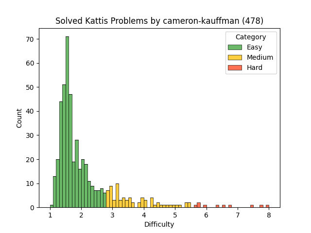

# Cameron's Kattis Problems

These are problems I have solved on [Kattis](https://open.kattis.com)
while preparing for competitive programming competitions.

### Problem Difficulty

<table>
<thead>
<td>Name</td>
<td>Difficulty</td>
<td>Link</td>
</thead>
<tbody>

<tr>
<td>Unique Dice</td>
<td>5.1</td>
<td>https://open.kattis.com/problems/uniquedice</td>
</tr>

<tr>
<td>Veci</td>
<td>2.0</td>
<td>https://open.kattis.com/problems/veci</td>
</tr>

<tr>
<td>Vefþjónatjón</td>
<td>1.6</td>
<td>https://open.kattis.com/problems/vefthjonatjon</td>
</tr>

<tr>
<td>Velkomin!</td>
<td>1.1</td>
<td>https://open.kattis.com/problems/velkomin</td>
</tr>

<tr>
<td>Veður - Lokaðar heiðar</td>
<td>1.4</td>
<td>https://open.kattis.com/problems/vedurheidar</td>
</tr>

<tr>
<td>Viðsnúningur</td>
<td>1.2</td>
<td>https://open.kattis.com/problems/vidsnuningur</td>
</tr>

<tr>
<td>Warehouse</td>
<td>2.2</td>
<td>https://open.kattis.com/problems/warehouse</td>
</tr>

<tr>
<td>Which is Greater?</td>
<td>1.3</td>
<td>https://open.kattis.com/problems/whichisgreater</td>
</tr>

<tr>
<td>Zamka</td>
<td>1.5</td>
<td>https://open.kattis.com/problems/zamka</td>
</tr>

<tr>
<td>Zoom</td>
<td>1.7</td>
<td>https://open.kattis.com/problems/zoom</td>
</tr>

<tr>
<td>Á leið í bíó</td>
<td>1.2</td>
<td>https://open.kattis.com/problems/aleidibio</td>
</tr>

<tr>
<td>Óvissa</td>
<td>1.2</td>
<td>https://open.kattis.com/problems/ovissa</td>
</tr>

<tr>
<td>3D Printed Statues</td>
<td>2.9</td>
<td>https://open.kattis.com/problems/3dprinter</td>
</tr>

<tr>
<td>99 Problems</td>
<td>2.8</td>
<td>https://open.kattis.com/problems/99problems</td>
</tr>

<tr>
<td>A Furious Cocktail</td>
<td>2.9</td>
<td>https://open.kattis.com/problems/cocktail</td>
</tr>

<tr>
<td>A Multiplication Game</td>
<td>4.8</td>
<td>https://open.kattis.com/problems/amultiplicationgame</td>
</tr>

<tr>
<td>A Real Challenge</td>
<td>1.7</td>
<td>https://open.kattis.com/problems/areal</td>
</tr>

<tr>
<td>Aaah!</td>
<td>1.7</td>
<td>https://open.kattis.com/problems/aaah</td>
</tr>

<tr>
<td>Above Average</td>
<td>2.6</td>
<td>https://open.kattis.com/problems/aboveaverage</td>
</tr>

<tr>
<td>Add Two Numbers</td>
<td>1.3</td>
<td>https://open.kattis.com/problems/addtwonumbers</td>
</tr>

<tr>
<td>Adding Trouble</td>
<td>1.3</td>
<td>https://open.kattis.com/problems/addingtrouble</td>
</tr>

<tr>
<td>Almost Sorted</td>
<td>8.4</td>
<td>https://open.kattis.com/problems/almostsorted2</td>
</tr>

<tr>
<td>Alphabet Spam</td>
<td>1.6</td>
<td>https://open.kattis.com/problems/alphabetspam</td>
</tr>

<tr>
<td>Amerískur vinnustaður</td>
<td>1.3</td>
<td>https://open.kattis.com/problems/ameriskur</td>
</tr>

<tr>
<td>Another Candies</td>
<td>2.8</td>
<td>https://open.kattis.com/problems/anothercandies</td>
</tr>

<tr>
<td>Apaxiaaaaaaaaaaaans!</td>
<td>1.5</td>
<td>https://open.kattis.com/problems/apaxiaaans</td>
</tr>

<tr>
<td>Array Smoothening</td>
<td>2.3</td>
<td>https://open.kattis.com/problems/arraysmoothening</td>
</tr>

<tr>
<td>Autori</td>
<td>1.3</td>
<td>https://open.kattis.com/problems/autori</td>
</tr>

<tr>
<td>Average Character</td>
<td>1.8</td>
<td>https://open.kattis.com/problems/averagecharacter</td>
</tr>

<tr>
<td>Avion</td>
<td>1.5</td>
<td>https://open.kattis.com/problems/avion</td>
</tr>

<tr>
<td>Babelfish</td>
<td>2.9</td>
<td>https://open.kattis.com/problems/babelfish</td>
</tr>

<tr>
<td>Bachet's Game</td>
<td>3.8</td>
<td>https://open.kattis.com/problems/bachetsgame</td>
</tr>

<tr>
<td>Backspace</td>
<td>2.4</td>
<td>https://open.kattis.com/problems/backspace</td>
</tr>

<tr>
<td>Basketball One-on-One</td>
<td>1.6</td>
<td>https://open.kattis.com/problems/basketballoneonone</td>
</tr>

<tr>
<td>Batter Up</td>
<td>1.5</td>
<td>https://open.kattis.com/problems/batterup</td>
</tr>

<tr>
<td>Bela</td>
<td>1.4</td>
<td>https://open.kattis.com/problems/bela</td>
</tr>

<tr>
<td>Betting</td>
<td>1.3</td>
<td>https://open.kattis.com/problems/betting</td>
</tr>

<tr>
<td>Biased Standings</td>
<td>3.9</td>
<td>https://open.kattis.com/problems/standings</td>
</tr>

<tr>
<td>Bijele</td>
<td>1.4</td>
<td>https://open.kattis.com/problems/bijele</td>
</tr>

<tr>
<td>Blueberry Waffle</td>
<td>1.9</td>
<td>https://open.kattis.com/problems/blueberrywaffle</td>
</tr>

<tr>
<td>Boat Parts</td>
<td>1.9</td>
<td>https://open.kattis.com/problems/boatparts</td>
</tr>

<tr>
<td>Boss Battle</td>
<td>1.8</td>
<td>https://open.kattis.com/problems/bossbattle</td>
</tr>

<tr>
<td>Branch Manager</td>
<td>5.7</td>
<td>https://open.kattis.com/problems/branchmanager</td>
</tr>

<tr>
<td>Building Pyramids</td>
<td>1.6</td>
<td>https://open.kattis.com/problems/pyramids</td>
</tr>

<tr>
<td>CPR Number</td>
<td>1.4</td>
<td>https://open.kattis.com/problems/cprnummer</td>
</tr>

<tr>
<td>Canadians, eh?</td>
<td>1.6</td>
<td>https://open.kattis.com/problems/canadianseh</td>
</tr>

<tr>
<td>Candy Distribution</td>
<td>3.9</td>
<td>https://open.kattis.com/problems/candydistribution</td>
</tr>

<tr>
<td>Candy Division</td>
<td>3.9</td>
<td>https://open.kattis.com/problems/candydivision</td>
</tr>

<tr>
<td>Cetvrta</td>
<td>1.5</td>
<td>https://open.kattis.com/problems/cetvrta</td>
</tr>

<tr>
<td>Chanukah Challenge</td>
<td>1.4</td>
<td>https://open.kattis.com/problems/chanukah</td>
</tr>

<tr>
<td>Class Field Trip</td>
<td>1.4</td>
<td>https://open.kattis.com/problems/classfieldtrip</td>
</tr>

<tr>
<td>Climbing Worm</td>
<td>2.4</td>
<td>https://open.kattis.com/problems/climbingworm</td>
</tr>

<tr>
<td>Coin Stacks</td>
<td>3.8</td>
<td>https://open.kattis.com/problems/coinstacks</td>
</tr>

<tr>
<td>Cold-puter Science</td>
<td>1.4</td>
<td>https://open.kattis.com/problems/cold</td>
</tr>

<tr>
<td>Coloring Socks</td>
<td>2.3</td>
<td>https://open.kattis.com/problems/color</td>
</tr>

<tr>
<td>Cosmic Path Optimization</td>
<td>1.5</td>
<td>https://open.kattis.com/problems/cosmicpathoptimization</td>
</tr>

<tr>
<td>Count the Vowels</td>
<td>1.4</td>
<td>https://open.kattis.com/problems/countthevowels</td>
</tr>

<tr>
<td>Counting Days</td>
<td>2.7</td>
<td>https://open.kattis.com/problems/countingdays</td>
</tr>

<tr>
<td>Cracking RSA</td>
<td>2.1</td>
<td>https://open.kattis.com/problems/crackingrsa</td>
</tr>

<tr>
<td>Cryptographer's Conundrum</td>
<td>1.5</td>
<td>https://open.kattis.com/problems/conundrum</td>
</tr>

<tr>
<td>Cudoviste</td>
<td>1.5</td>
<td>https://open.kattis.com/problems/cudoviste</td>
</tr>

<tr>
<td>Cut in Line</td>
<td>1.6</td>
<td>https://open.kattis.com/problems/cutinline</td>
</tr>

<tr>
<td>Cut the Negativity</td>
<td>1.4</td>
<td>https://open.kattis.com/problems/cutthenegativity</td>
</tr>

<tr>
<td>Datum</td>
<td>1.6</td>
<td>https://open.kattis.com/problems/datum</td>
</tr>

<tr>
<td>Daydreaming Stockbroker</td>
<td>3.5</td>
<td>https://open.kattis.com/problems/stockbroker</td>
</tr>

<tr>
<td>Daylight Saving Time</td>
<td>2.2</td>
<td>https://open.kattis.com/problems/dst</td>
</tr>

<tr>
<td>Detailed Differences</td>
<td>1.4</td>
<td>https://open.kattis.com/problems/detaileddifferences</td>
</tr>

<tr>
<td>Dice Cup</td>
<td>1.4</td>
<td>https://open.kattis.com/problems/dicecup</td>
</tr>

<tr>
<td>Digit Product</td>
<td>1.6</td>
<td>https://open.kattis.com/problems/sifferprodukt</td>
</tr>

<tr>
<td>Digit Swap</td>
<td>1.3</td>
<td>https://open.kattis.com/problems/digitswap</td>
</tr>

<tr>
<td>Divvying Up</td>
<td>1.6</td>
<td>https://open.kattis.com/problems/divvyingup</td>
</tr>

<tr>
<td>Double Password</td>
<td>1.6</td>
<td>https://open.kattis.com/problems/doublepassword</td>
</tr>

<tr>
<td>Drunk Vigenère</td>
<td>1.7</td>
<td>https://open.kattis.com/problems/drunkvigenere</td>
</tr>

<tr>
<td>Echo Echo Echo</td>
<td>1.3</td>
<td>https://open.kattis.com/problems/echoechoecho</td>
</tr>

<tr>
<td>Ekki dauði opna inni</td>
<td>1.5</td>
<td>https://open.kattis.com/problems/ekkidaudi</td>
</tr>

<tr>
<td>Eligibility</td>
<td>1.6</td>
<td>https://open.kattis.com/problems/eligibility</td>
</tr>

<tr>
<td>Encoded Message</td>
<td>1.5</td>
<td>https://open.kattis.com/problems/encodedmessage</td>
</tr>

<tr>
<td>Exam</td>
<td>2.2</td>
<td>https://open.kattis.com/problems/exam</td>
</tr>

<tr>
<td>Expected Earnings</td>
<td>1.9</td>
<td>https://open.kattis.com/problems/expectedearnings</td>
</tr>

<tr>
<td>Eye of Sauron</td>
<td>1.4</td>
<td>https://open.kattis.com/problems/eyeofsauron</td>
</tr>

<tr>
<td>FYI</td>
<td>1.3</td>
<td>https://open.kattis.com/problems/fyi</td>
</tr>

<tr>
<td>Fading Wind</td>
<td>1.5</td>
<td>https://open.kattis.com/problems/fadingwind</td>
</tr>

<tr>
<td>Faktor</td>
<td>1.4</td>
<td>https://open.kattis.com/problems/faktor</td>
</tr>

<tr>
<td>Falling Mugs</td>
<td>3.7</td>
<td>https://open.kattis.com/problems/falling</td>
</tr>

<tr>
<td>Filip</td>
<td>1.4</td>
<td>https://open.kattis.com/problems/filip</td>
</tr>

<tr>
<td>Finding An A</td>
<td>1.4</td>
<td>https://open.kattis.com/problems/findingana</td>
</tr>

<tr>
<td>FizzBuzz</td>
<td>1.4</td>
<td>https://open.kattis.com/problems/fizzbuzz</td>
</tr>

<tr>
<td>Flatbökuveisla</td>
<td>1.2</td>
<td>https://open.kattis.com/problems/flatbokuveisla</td>
</tr>

<tr>
<td>Flýtibaka</td>
<td>1.5</td>
<td>https://open.kattis.com/problems/flytibaka</td>
</tr>

<tr>
<td>Framtíðar FIFA</td>
<td>1.2</td>
<td>https://open.kattis.com/problems/fifa</td>
</tr>

<tr>
<td>Free Food</td>
<td>1.6</td>
<td>https://open.kattis.com/problems/freefood</td>
</tr>

<tr>
<td>Friday the 13th</td>
<td>2.1</td>
<td>https://open.kattis.com/problems/friday</td>
</tr>

<tr>
<td>GCD</td>
<td>1.6</td>
<td>https://open.kattis.com/problems/gcd</td>
</tr>

<tr>
<td>GCVWR</td>
<td>1.3</td>
<td>https://open.kattis.com/problems/gcvwr</td>
</tr>

<tr>
<td>Gandalf's Spell</td>
<td>2.1</td>
<td>https://open.kattis.com/problems/gandalfsspell</td>
</tr>

<tr>
<td>Grade Curving</td>
<td>4.7</td>
<td>https://open.kattis.com/problems/gradecurving</td>
</tr>

<tr>
<td>Grading</td>
<td>1.5</td>
<td>https://open.kattis.com/problems/grading</td>
</tr>

<tr>
<td>Grass Seed Inc.</td>
<td>1.4</td>
<td>https://open.kattis.com/problems/grassseed</td>
</tr>

<tr>
<td>Greetings!</td>
<td>1.3</td>
<td>https://open.kattis.com/problems/greetings2</td>
</tr>

<tr>
<td>Hangman</td>
<td>1.6</td>
<td>https://open.kattis.com/problems/hangman</td>
</tr>

<tr>
<td>Harshad Numbers</td>
<td>1.5</td>
<td>https://open.kattis.com/problems/harshadnumbers</td>
</tr>

<tr>
<td>Heart Rate</td>
<td>1.4</td>
<td>https://open.kattis.com/problems/heartrate</td>
</tr>

<tr>
<td>Hello World!</td>
<td>1.1</td>
<td>https://open.kattis.com/problems/hello</td>
</tr>

<tr>
<td>Hissing Microphone</td>
<td>1.4</td>
<td>https://open.kattis.com/problems/hissingmicrophone</td>
</tr>

<tr>
<td>Homework</td>
<td>1.6</td>
<td>https://open.kattis.com/problems/heimavinna</td>
</tr>

<tr>
<td>Hraðgreining</td>
<td>1.3</td>
<td>https://open.kattis.com/problems/hradgreining</td>
</tr>

<tr>
<td>I Hate The Number Nine</td>
<td>3.2</td>
<td>https://open.kattis.com/problems/nine</td>
</tr>

<tr>
<td>I've Been Everywhere, Man</td>
<td>1.4</td>
<td>https://open.kattis.com/problems/everywhere</td>
</tr>

<tr>
<td>ICPC Awards</td>
<td>1.6</td>
<td>https://open.kattis.com/problems/icpcawards</td>
</tr>

<tr>
<td>International Dates</td>
<td>1.5</td>
<td>https://open.kattis.com/problems/internationaldates</td>
</tr>

<tr>
<td>IsItHalloween.com</td>
<td>1.4</td>
<td>https://open.kattis.com/problems/isithalloween</td>
</tr>

<tr>
<td>Jack-O'-Lantern Juxtaposition</td>
<td>1.2</td>
<td>https://open.kattis.com/problems/jackolanternjuxtaposition</td>
</tr>

<tr>
<td>Janitor Troubles</td>
<td>1.5</td>
<td>https://open.kattis.com/problems/janitortroubles</td>
</tr>

<tr>
<td>Judging Moose</td>
<td>1.6</td>
<td>https://open.kattis.com/problems/judgingmoose</td>
</tr>

<tr>
<td>Jumbo Javelin</td>
<td>1.3</td>
<td>https://open.kattis.com/problems/jumbojavelin</td>
</tr>

<tr>
<td>Just a Minute</td>
<td>1.9</td>
<td>https://open.kattis.com/problems/justaminute</td>
</tr>

<tr>
<td>Knight Packing</td>
<td>1.3</td>
<td>https://open.kattis.com/problems/knightpacking</td>
</tr>

<tr>
<td>Knot Knowledge</td>
<td>1.4</td>
<td>https://open.kattis.com/problems/knotknowledge</td>
</tr>

<tr>
<td>Kornislav</td>
<td>1.5</td>
<td>https://open.kattis.com/problems/kornislav</td>
</tr>

<tr>
<td>Ladder</td>
<td>1.5</td>
<td>https://open.kattis.com/problems/ladder</td>
</tr>

<tr>
<td>Laptop Sticker</td>
<td>1.5</td>
<td>https://open.kattis.com/problems/laptopsticker</td>
</tr>

<tr>
<td>Last Factorial Digit</td>
<td>1.4</td>
<td>https://open.kattis.com/problems/lastfactorialdigit</td>
</tr>

<tr>
<td>Left Beehind</td>
<td>1.8</td>
<td>https://open.kattis.com/problems/leftbeehind</td>
</tr>

<tr>
<td>Leggja saman</td>
<td>1.2</td>
<td>https://open.kattis.com/problems/leggjasaman</td>
</tr>

<tr>
<td>License to Launch</td>
<td>1.6</td>
<td>https://open.kattis.com/problems/licensetolaunch</td>
</tr>

<tr>
<td>Liquid Assets</td>
<td>3.4</td>
<td>https://open.kattis.com/problems/liquidassets</td>
</tr>

<tr>
<td>Locked Treasure</td>
<td>2.5</td>
<td>https://open.kattis.com/problems/lockedtreasure</td>
</tr>

<tr>
<td>Longest Prime Sum</td>
<td>2.4</td>
<td>https://open.kattis.com/problems/longestprimesum</td>
</tr>

<tr>
<td>Lost Lineup</td>
<td>1.6</td>
<td>https://open.kattis.com/problems/lostlineup</td>
</tr>

<tr>
<td>Making A Meowth</td>
<td>1.6</td>
<td>https://open.kattis.com/problems/makingameowth</td>
</tr>

<tr>
<td>Math Homework</td>
<td>2.0</td>
<td>https://open.kattis.com/problems/mathhomework</td>
</tr>

<tr>
<td>Metronome</td>
<td>1.2</td>
<td>https://open.kattis.com/problems/metronome</td>
</tr>

<tr>
<td>Millifærsla</td>
<td>1.3</td>
<td>https://open.kattis.com/problems/millifaersla</td>
</tr>

<tr>
<td>Missing Number</td>
<td>3.3</td>
<td>https://open.kattis.com/problems/missingnumber</td>
</tr>

<tr>
<td>Modulo</td>
<td>1.5</td>
<td>https://open.kattis.com/problems/modulo</td>
</tr>

<tr>
<td>Monopoly</td>
<td>1.4</td>
<td>https://open.kattis.com/problems/monopol</td>
</tr>

<tr>
<td>Mumble Rap</td>
<td>1.7</td>
<td>https://open.kattis.com/problems/mumblerap</td>
</tr>

<tr>
<td>N-sum</td>
<td>1.3</td>
<td>https://open.kattis.com/problems/nsum</td>
</tr>

<tr>
<td>Nasty Hacks</td>
<td>1.4</td>
<td>https://open.kattis.com/problems/nastyhacks</td>
</tr>

<tr>
<td>No Duplicates</td>
<td>1.5</td>
<td>https://open.kattis.com/problems/nodup</td>
</tr>

<tr>
<td>Number Fun</td>
<td>1.5</td>
<td>https://open.kattis.com/problems/numberfun</td>
</tr>

<tr>
<td>Numbers On a Tree</td>
<td>2.7</td>
<td>https://open.kattis.com/problems/numbertree</td>
</tr>

<tr>
<td>Odd Echo</td>
<td>1.3</td>
<td>https://open.kattis.com/problems/oddecho</td>
</tr>

<tr>
<td>Odd Man Out</td>
<td>1.5</td>
<td>https://open.kattis.com/problems/oddmanout</td>
</tr>

<tr>
<td>Oddities</td>
<td>1.4</td>
<td>https://open.kattis.com/problems/oddities</td>
</tr>

<tr>
<td>Pachyderm Peanut Packing</td>
<td>2.1</td>
<td>https://open.kattis.com/problems/pachydermpeanutpacking</td>
</tr>

<tr>
<td>Pet</td>
<td>1.5</td>
<td>https://open.kattis.com/problems/pet</td>
</tr>

<tr>
<td>Piece of Cake!</td>
<td>1.3</td>
<td>https://open.kattis.com/problems/pieceofcake2</td>
</tr>

<tr>
<td>Pizza Crust</td>
<td>1.9</td>
<td>https://open.kattis.com/problems/pizza2</td>
</tr>

<tr>
<td>Planina</td>
<td>1.6</td>
<td>https://open.kattis.com/problems/planina</td>
</tr>

<tr>
<td>Pokechat</td>
<td>1.4</td>
<td>https://open.kattis.com/problems/pokechat</td>
</tr>

<tr>
<td>Pot</td>
<td>1.5</td>
<td>https://open.kattis.com/problems/pot</td>
</tr>

<tr>
<td>Power of Divisors</td>
<td>6.1</td>
<td>https://open.kattis.com/problems/powerofdivisors</td>
</tr>

<tr>
<td>Product Divisors</td>
<td>7.1</td>
<td>https://open.kattis.com/problems/productdivisors</td>
</tr>

<tr>
<td>Ptice</td>
<td>1.6</td>
<td>https://open.kattis.com/problems/ptice</td>
</tr>

<tr>
<td>Quadrant Selection</td>
<td>1.3</td>
<td>https://open.kattis.com/problems/quadrant</td>
</tr>

<tr>
<td>Quality-Adjusted Life-Year</td>
<td>1.3</td>
<td>https://open.kattis.com/problems/qaly</td>
</tr>

<tr>
<td>Quick Estimates</td>
<td>1.6</td>
<td>https://open.kattis.com/problems/quickestimate</td>
</tr>

<tr>
<td>R2</td>
<td>1.5</td>
<td>https://open.kattis.com/problems/r2</td>
</tr>

<tr>
<td>Rating Problems</td>
<td>1.4</td>
<td>https://open.kattis.com/problems/ratingproblems</td>
</tr>

<tr>
<td>Rectangle Area</td>
<td>1.6</td>
<td>https://open.kattis.com/problems/rectanglearea</td>
</tr>

<tr>
<td>Relatives</td>
<td>3.3</td>
<td>https://open.kattis.com/problems/relatives</td>
</tr>

<tr>
<td>Reverse</td>
<td>1.6</td>
<td>https://open.kattis.com/problems/ofugsnuid</td>
</tr>

<tr>
<td>Reversed Binary Numbers</td>
<td>1.5</td>
<td>https://open.kattis.com/problems/reversebinary</td>
</tr>

<tr>
<td>SMIL</td>
<td>1.6</td>
<td>https://open.kattis.com/problems/smil</td>
</tr>

<tr>
<td>Same Digits (Easy)</td>
<td>2.3</td>
<td>https://open.kattis.com/problems/samedigitseasy</td>
</tr>

<tr>
<td>School Spirit</td>
<td>1.8</td>
<td>https://open.kattis.com/problems/schoolspirit</td>
</tr>

<tr>
<td>Secure Doors</td>
<td>1.6</td>
<td>https://open.kattis.com/problems/securedoors</td>
</tr>

<tr>
<td>Seven Wonders</td>
<td>1.5</td>
<td>https://open.kattis.com/problems/sevenwonders</td>
</tr>

<tr>
<td>Shattered Cake</td>
<td>1.5</td>
<td>https://open.kattis.com/problems/shatteredcake</td>
</tr>

<tr>
<td>Sibice</td>
<td>1.5</td>
<td>https://open.kattis.com/problems/sibice</td>
</tr>

<tr>
<td>Simon Says</td>
<td>1.6</td>
<td>https://open.kattis.com/problems/simonsays</td>
</tr>

<tr>
<td>Simple Addition</td>
<td>2.1</td>
<td>https://open.kattis.com/problems/simpleaddition</td>
</tr>

<tr>
<td>Sith</td>
<td>1.5</td>
<td>https://open.kattis.com/problems/sith</td>
</tr>

<tr>
<td>Sky Islands</td>
<td>2.0</td>
<td>https://open.kattis.com/problems/skyislands</td>
</tr>

<tr>
<td>Solving for Carrots</td>
<td>1.4</td>
<td>https://open.kattis.com/problems/carrots</td>
</tr>

<tr>
<td>Sort Two Numbers</td>
<td>1.4</td>
<td>https://open.kattis.com/problems/sorttwonumbers</td>
</tr>

<tr>
<td>Space Race</td>
<td>2.2</td>
<td>https://open.kattis.com/problems/spacerace</td>
</tr>

<tr>
<td>Spavanac</td>
<td>1.5</td>
<td>https://open.kattis.com/problems/spavanac</td>
</tr>

<tr>
<td>Speedrun</td>
<td>2.3</td>
<td>https://open.kattis.com/problems/speedrun</td>
</tr>

<tr>
<td>Spelling Bee</td>
<td>2.2</td>
<td>https://open.kattis.com/problems/spellingbee</td>
</tr>

<tr>
<td>Spritt</td>
<td>1.4</td>
<td>https://open.kattis.com/problems/spritt</td>
</tr>

<tr>
<td>Stacking Cups</td>
<td>1.6</td>
<td>https://open.kattis.com/problems/cups</td>
</tr>

<tr>
<td>Stafur</td>
<td>1.6</td>
<td>https://open.kattis.com/problems/stafur</td>
</tr>

<tr>
<td>Stand on Zanzibar</td>
<td>1.5</td>
<td>https://open.kattis.com/problems/zanzibar</td>
</tr>

<tr>
<td>Sticky Keys</td>
<td>1.5</td>
<td>https://open.kattis.com/problems/stickykeys</td>
</tr>

<tr>
<td>Stopwatch</td>
<td>1.6</td>
<td>https://open.kattis.com/problems/stopwatch</td>
</tr>

<tr>
<td>Stream Lag</td>
<td>3.1</td>
<td>https://open.kattis.com/problems/streamlag</td>
</tr>

<tr>
<td>Stuck In A Time Loop</td>
<td>1.3</td>
<td>https://open.kattis.com/problems/timeloop</td>
</tr>

<tr>
<td>Subprime</td>
<td>4.1</td>
<td>https://open.kattis.com/problems/subprime</td>
</tr>

<tr>
<td>Sum Kind of Problem</td>
<td>1.6</td>
<td>https://open.kattis.com/problems/sumkindofproblem</td>
</tr>

<tr>
<td>Sum Squared Digits Function</td>
<td>1.5</td>
<td>https://open.kattis.com/problems/sumsquareddigits</td>
</tr>

<tr>
<td>Sóttkví</td>
<td>1.5</td>
<td>https://open.kattis.com/problems/sottkvi</td>
</tr>

<tr>
<td>Take Two Stones</td>
<td>1.4</td>
<td>https://open.kattis.com/problems/twostones</td>
</tr>

<tr>
<td>Tarifa</td>
<td>1.4</td>
<td>https://open.kattis.com/problems/tarifa</td>
</tr>

<tr>
<td>Temperature Confusion</td>
<td>2.9</td>
<td>https://open.kattis.com/problems/temperatureconfusion</td>
</tr>

<tr>
<td>Tetration</td>
<td>1.6</td>
<td>https://open.kattis.com/problems/tetration</td>
</tr>

<tr>
<td>The Amazing Human Cannonball</td>
<td>1.5</td>
<td>https://open.kattis.com/problems/humancannonball2</td>
</tr>

<tr>
<td>The Last Problem</td>
<td>1.6</td>
<td>https://open.kattis.com/problems/thelastproblem</td>
</tr>

<tr>
<td>The Plank</td>
<td>1.6</td>
<td>https://open.kattis.com/problems/theplank</td>
</tr>

<tr>
<td>This Ain't Your Grandpa's Checkerboard</td>
<td>1.7</td>
<td>https://open.kattis.com/problems/thisaintyourgrandpascheckerboard</td>
</tr>

<tr>
<td>Title Cost</td>
<td>1.7</td>
<td>https://open.kattis.com/problems/titlecost</td>
</tr>

<tr>
<td>Tower Construction</td>
<td>1.7</td>
<td>https://open.kattis.com/problems/tornbygge</td>
</tr>

<tr>
<td>Triangle Area</td>
<td>1.4</td>
<td>https://open.kattis.com/problems/triarea</td>
</tr>

<tr>
<td>Trik</td>
<td>1.5</td>
<td>https://open.kattis.com/problems/trik</td>
</tr>

<tr>
<td>Triple Texting</td>
<td>1.8</td>
<td>https://open.kattis.com/problems/tripletexting</td>
</tr>

<tr>
<td>Troll Hunt</td>
<td>2.6</td>
<td>https://open.kattis.com/problems/trollhunt</td>
</tr>

<tr>
<td>Turn It Up!</td>
<td>1.6</td>
<td>https://open.kattis.com/problems/skruop</td>
</tr>

<tr>
<td>Two-sum</td>
<td>1.3</td>
<td>https://open.kattis.com/problems/twosum</td>
</tr>

<tr>
<td>Tölvunarfræðingar telja</td>
<td>1.1</td>
<td>https://open.kattis.com/problems/tolvunarfraedingartelja</td>
</tr>

<tr>
<td>Ultimate Binary Watch</td>
<td>1.8</td>
<td>https://open.kattis.com/problems/ultimatebinarywatch</td>
</tr>

<tr>
<td>Undead or Alive</td>
<td>1.4</td>
<td>https://open.kattis.com/problems/undeadoralive</td>
</tr>
